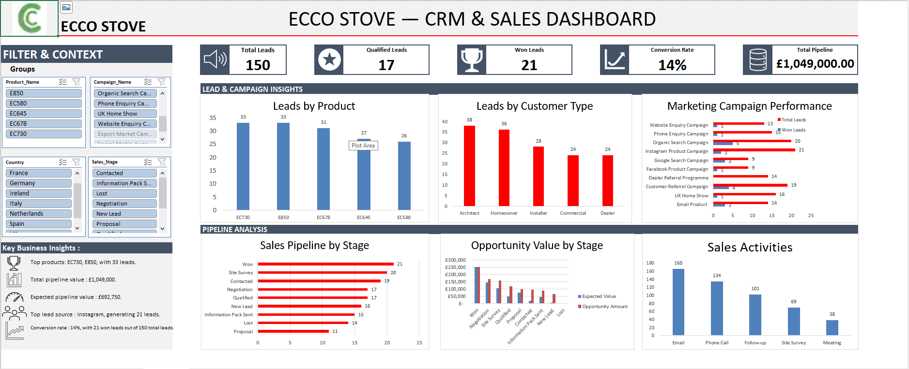

# Ecco Stove CRM & Sales Dashboard

An Excel-based CRM and sales analytics solution developed as a portfolio
project for the Ecco Stove internship opportunity.

## Project Overview

This project demonstrates how Excel, Power Query, Power Pivot,
data modelling, CRM concepts and interactive dashboards can be combined
to transform raw customer and lead data into actionable business insights.

## Business Objectives

- Centralize customer and lead information
- Improve data quality and consistency
- Track the sales pipeline
- Monitor opportunities and expected revenue
- Analyse marketing campaign performance
- Monitor sales activities
- Provide an interactive management dashboard

## CRM Architecture

Raw Customer Data
→ Power Query
→ CRM Tables
→ Data Model
→ Pivot Analysis
→ Dynamic KPIs
→ Interactive Dashboard

## Main CRM Tables

- Customers
- Leads
- Products
- Activities
- Opportunities
- Marketing Campaigns

## Data Preparation

Power Query was used to:

- Clean and standardize text fields
- Normalize country and product values
- Handle missing values
- Identify and remove duplicate customer records
- Create calculated fields
- Assign lead scores
- Generate follow-up dates
- Prepare data for the CRM data model

## Dashboard

The dashboard provides:

- Total Leads
- Qualified Leads
- Won Leads
- Conversion Rate
- Total Pipeline Value
- Sales Pipeline Analysis
- Campaign Performance
- Product Performance
- Customer Type Analysis
- Opportunity Value Analysis
- Sales Activity Analysis
- Dynamic Business Insights

## Key Metrics

| KPI | Value |
|---|---:|
| Total Leads | 150 |
| Qualified Leads | 17 |
| Won Leads | 21 |
| Conversion Rate | 14% |
| Total Pipeline Value | £1,049,000 |
| Expected Pipeline Value | £692,750 |
| Total Activities | 507 |

## Dashboard Preview

## Tools & Technologies

- Microsoft Excel
- Power Query
- Power Pivot
- DAX
- PivotTables
- PivotCharts
- Data Modelling
- CRM Analytics

## How to Use

1. Download `Ecco_Stove_CRM.xlsx`
2. Open the workbook in Microsoft Excel
3. Navigate to the Dashboard sheet
4. Use the slicers to filter the dashboard
5. Explore the CRM and analytical worksheets

## Data Privacy

The customer data used in this project is synthetic and created
for demonstration and portfolio purposes. No real customer
personal information is included.

## Author

Abdallah Mohamed
